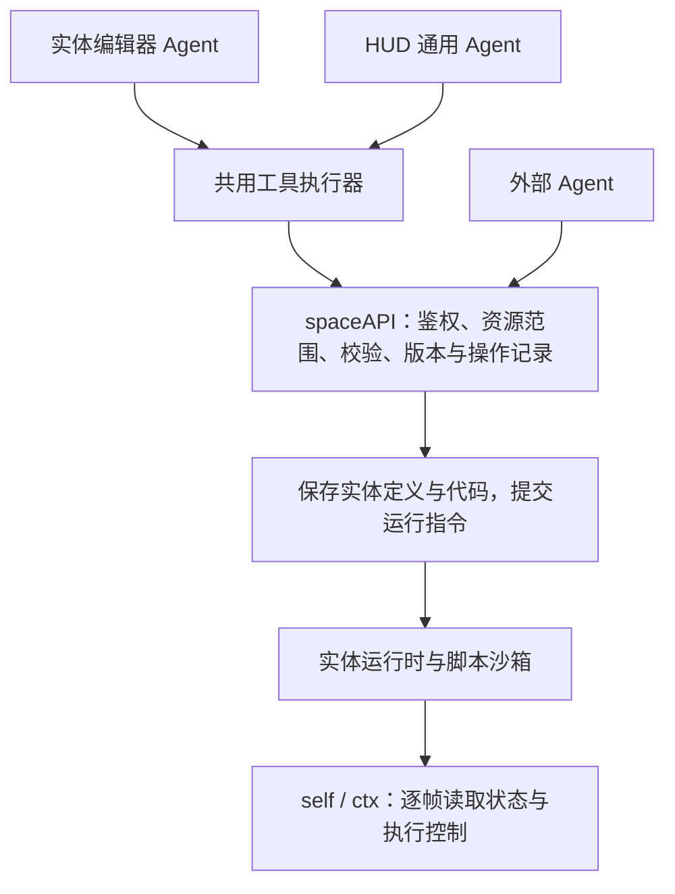

# Space 的三种 Agent 接入方式

[spaceAPI](../../../entropydrop_backend/space/agent/spaceAPI.md) · [entityAPI](../../engine/docs/generated/api-v2.md)

entityAPI 是实体代码中通过 `self` / `ctx` 调用的运行时接口；spaceAPI 是 Agent 和客户端使用的 HTTP 接口。

状态：推荐架构与分步迁移方案。主站已介绍这些用法及当前进度；本文不表示网页助手已经完成统一 API 迁移。

## 结论

保留三个产品入口，复用一个 Agent 工具执行器、一套 spaceAPI 和一份版本化的公开 Skill。三者的区别是默认上下文、可访问资源和授权方式，而不是各自维护一套世界操作逻辑。

| 入口 | 目标用途 | 授权边界 | 当前实现 |
| --- | --- | --- | --- |
| 实体编辑器中的编程 Agent | 编辑当前实体的结构、颜色、物理配置、约束、全部组件和代码 | 当前 `world_id + entity_id`，所有可编辑字段及组件；不能更改所有者、权限或系统维护字段 | 生成组件脚本，由玩家点击 Apply 应用 |
| HUD 通用 Agent | 查询世界、在玩家附近建造、协调多个实体 | 当前玩家获授权的 Space 接口、世界与资源 | AI BUILD 生成 BuildPlan，客户端验证、预览和施工 |
| 外部 spaceAPI Agent | 从外部 Agent、终端和自动化程序执行相同种类的世界任务 | 完整 Space 权限；受世界访问与资源所有权约束 | 自身保存位置、实体创建、读取及修改自有实体代码和默认属性、启动／停止、方块组建造 |

“通用”意味着可以使用所有向该玩家开放且已获授权的 Space 能力。服务管理、执行租约、计费管理和其他玩家私有资源不因 Agent 模式而自动开放。

## 两层接口

- spaceAPI 负责查询、创建、修改、运行状态和结果查询。Agent 提交有结构的操作，不获取 `world`、`contraption`、渲染器或物理引擎实例。
- entityAPI（`self` / `ctx`）供实体脚本逐帧使用，维持力、扭矩、悬挂和传感器响应。逐帧控制保留在运行时，不改成每帧网络请求。
- Agent 可以阅读 entityAPI 文档并生成调用这些接口的代码。代码必须通过 spaceAPI 保存、校验和部署到实体，再由沙箱执行；这不等于 Agent 获得运行时调用入口。
- 原有手工编辑器和引擎可以继续通过自身内部接口工作。收敛的是 Agent 的操作边界，而不是把引擎每个函数都公开成 HTTP 接口。

## 权限必须落在执行层

实体 Agent 的限制不能只写在 Skill 或系统提示词中。工具执行器筛选工具和上下文，spaceAPI 再校验主体、世界成员资格、实体所有权/协作权限、动作权限与目标实体。

建议网页登录后签发短期 Agent 会话授权。实体模式绑定一个世界和一个实体；HUD 模式绑定玩家选定的世界与允许的操作。切换实体时重新创建或收窄会话。凭证由执行器附加到请求，不作为模型提示词内容。外部调用使用可撤销的 spaceAPI Key，统一拥有全部 Space API 动作权限，已有 Key 自动适用，无需重建；世界成员资格、资源所有权及配额仍由后端校验。

不要把完整登录令牌直接交给受限实体 Agent 使用，否则它仍可能凭同一个令牌调用其他接口。短期会话的资源限制应由后端验证，而不是由调用者提供一个可任意修改的 `entity_id` 就视为授权。

同时检查生成代码的执行权限。现有脚本契约包含 `ctx.selection`、世界查询等能力，仅限制“修改哪一份代码”不能保证该代码运行后只影响本实体。需要为脚本可见能力和引擎命令提交增加实体资源边界，尤其是选择、删除、组装等操作；否则可通过代码绕过 Agent 的实体限制。正常物理碰撞产生的影响与主动编辑其他资源应分开定义。

## Skill 与机器可读工具契约

保留 `/space/agent/SKILL.md` 作为公共入口，描述坐标、工作流、错误处理和能力边界。按需引用实体编辑、世界建造和 entityAPI 文档，避免把全部文档塞进每一次对话。

spaceAPI 的 OpenAPI / JSON Schema 是请求格式的来源，Skill 解释如何使用它们。网页工具执行器和外部 SDK 使用同一份契约。网络工具只把 Space 授权凭证发送到配置的 spaceAPI origin；模型服务的 API Key 与 Space 的授权凭证分开管理。

文档版本与后端能力应可查询。对尚未开放、当前模式无权使用或当前版本不支持的操作，返回明确错误，不能回退到直接调用浏览器内部对象。

## 需要补齐的 API 与状态同步

已开放 `GET /entities/{entity_id}/configuration` 读取自有实体定义，`PATCH /entities/{entity_id}/configuration` 修改组件代码、名称和 BodyConfig 默认属性；编辑需要 `space:entity:edit`。`PUT /entities/{entity_id}/run-state` 支持 API Key，通过 `space:entity:run` 启动／停止。路径均在 `/space/api/v2/worlds/{world_id}` 下。实体只有运行／停止两种状态，组件代码开关不构成第三种状态。

配置修改必须先停止并提供 `expected_revision`，之后可单独启动。编辑和运行指令都有持久操作回执，延迟重试不会覆盖较新的操作。停止／配置修改保留最近保存的根位置和朝向，清除旧运行变量、子组件姿态和临时物理参数。浏览器仍需在线获取执行租约；HTTP 成功表示后端已保存指令，不表示脚本已经执行。

列表、二进制定义、快照和 checkpoint 等通用同步路由仍使用网页登录鉴权，不能把 API Key 当成通用登录凭证。浏览器 checkpoint 包含执行权相关语义，不作为 Agent 的编辑接口。

后续扩展实体结构编辑、独立代码校验及运行时实际应用结果接口。复用现有校验与持久化服务，避免复制一套实体逻辑。是否用完整定义更新或结构化 patch，可按实体格式决定；不要允许任意对象路径写入。

配置写入携带预期版本（当前与运行快照共用 revision），防止 Agent 覆盖玩家同时进行的编辑。变更应保留操作 ID 与可读差异，方便重试、追踪和恢复。后续可将定义版本与频繁变化的运行快照版本拆分。运行中的实体应由持有执行权的浏览器或托管运行时接收更新，并返回实际应用结果；HTTP 接收成功不等于运行时已完成变更。

现有外部创建已经有幂等操作 ID，可继续沿用这一思路。后端接受命令后通过现有同步通道通知客户端，前端据此更新编辑器与世界。Agent 不应同时修改本地实例和远端记录。

离线模式如需保留 Agent 能力，可以提供同一工具契约的本地适配器，并明确显示离线状态和能力差异；不伪造服务器已接受或世界已同步的结果。

## 迁移顺序

1. 整理公开 API 的动作与资源权限，补齐实体更新、代码校验和状态返回；明确服务内部路由与玩家接口的区别。
2. 增加短期 Agent 会话授权、后端实体范围校验及脚本运行时的资源限制。
3. 实现共用工具执行器，先将实体助手接入，验证单实体编辑、冲突处理和代码部署。
4. 将 HUD AI BUILD 扩展为同一执行器上的通用模式，接入查询、建造与多个实体的操作。
5. 将相同能力向拥有完整 Space 权限的外部 API Key 开放，同步更新公开 Skill 和示例。

主站当前应同时说明入口、目标用途和已实现的能力；不把上述迁移计划描述为已经上线。

## 代码依据与参考

- `src/engine/contraption/AgentChat.ts`：现有组件代码生成提示词与模型调用。
- `src/engine/building/BuildAgent.ts`：现有 BuildPlan 生成契约。
- `src/ui/react/store/SpaceUiStore.ts`：当前代码应用与建造方案预览入口。
- 后端 `routers/space_entities.py`、`routers/space_agent.py`、`routers/space_external.py`：现有实体、位置与建造接口。
- 共享引擎 `docs/generated/agent-api-v2.md`：entityAPI，包含 `ctx.selection`。
- [RFC 9396：细粒度授权请求](https://www.rfc-editor.org/rfc/rfc9396.html) 支持将资源和动作表达为授权数据；这里借鉴其授权边界设计，不要求立即引入完整 OAuth 扩展。
