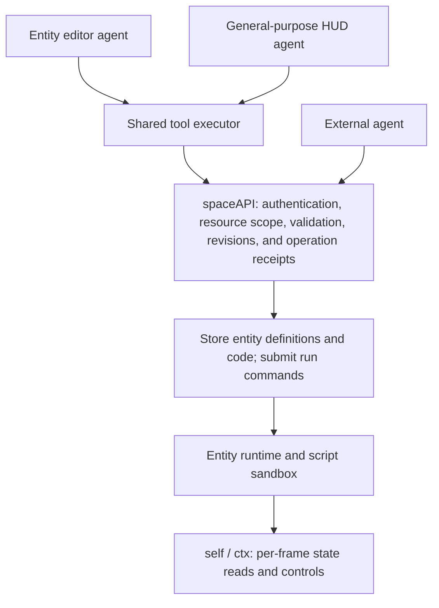

# Three Agent Access Modes in Space

[spaceAPI](../../server/space/agent/spaceAPI.md) · [entityAPI](../../engine/docs/generated/api-v2.md)

entityAPI is the runtime interface called by entity code through `self` / `ctx`; spaceAPI is the HTTP interface used by agents and clients.

Status: recommended architecture and phased migration plan. HUD Agent Build now onboards external spaceAPI agents; the entity editor assistant has not completed the unified API migration.

## Conclusion

Keep three product entry points while reusing one agent tool executor, one spaceAPI, and one versioned public Skill. They differ in default context, accessible resources, and authorization—not in separate implementations of world operations.

| Entry point | Intended use | Authorization boundary | Current implementation |
| --- | --- | --- | --- |
| Programming agent in the entity editor | Edit the current entity's structure, color, physics configuration, constraints, components, and code | The current `world_id + entity_id` and all editable fields and components; cannot change owners, permissions, or system-maintained fields | Generates component scripts that the player applies by clicking Apply |
| HUD Agent Build | Connect an external agent to query the world and build near the player | Full Space API-key permissions, constrained by world access and exclusive execution occupancy | Agent prompt, public API/Skill links, and API-key management; replaces the retired AI BUILD plan assistant |
| External spaceAPI agent | Perform the same kinds of world tasks from an external agent, terminal, or automation | Full Space permissions, constrained by world access and exclusive execution occupancy | Reads its own position; creates entities; reads world entities and edits stopped/unoccupied code and defaults; starts/stops unoccupied entities; builds blocksets |

“General-purpose” means the agent can use all authorized Space capabilities available to that player. Service administration, execution leases, billing management, and other players' private resources do not become available merely because the caller is an agent.

## Two interface layers

- spaceAPI handles queries, creation, modification, run state, and result lookup. Agents submit structured operations; they do not receive `world`, `contraption`, renderer, or physics-engine instances.
- entityAPI (`self` / `ctx`) is used by entity scripts every frame to maintain forces, torques, suspension, and sensor responses. Per-frame control stays in the runtime instead of becoming a network request every frame.
- Agents may read the entityAPI documentation and generate code that calls it. The code must be stored, validated, and deployed to an entity through spaceAPI before the sandbox executes it. This does not give the agent a direct runtime call surface.
- Existing manual editors and engine code may continue using their internal interfaces. The goal is to converge the agent boundary, not expose every engine function over HTTP.

## Permissions must be enforced at execution time

Entity-agent restrictions cannot exist only in a Skill or system prompt. The tool executor filters tools and context; spaceAPI then validates the principal, world membership, exclusive execution occupancy, action permissions, and target entity. World-entity authorship is attribution only; publisher permissions apply to market resources, not placed copies.

After web login, issue short-lived agent-session authorization. Entity mode binds one world and one entity; HUD mode binds the player's selected world and allowed operations. Recreate or narrow the session when switching entities. The executor attaches credentials to requests rather than placing them in model prompts. External calls use revocable spaceAPI keys. Every existing and new key has the full Space action set; world membership, execution occupancy, market publisher rights, and quotas remain enforced by the backend.

Do not hand a full login token directly to a restricted entity agent. The same token could call unrelated endpoints. The backend must enforce short-lived session resource limits rather than treating a caller-supplied, mutable `entity_id` as authorization.

Generated code also needs execution-time capability checks. The current script contract includes capabilities such as `ctx.selection` and world queries. Restricting which code document an agent may edit does not guarantee that the resulting code affects only that entity. Script-visible capabilities and engine-command submission need entity-scoped boundaries, especially for selection, deletion, and assembly. Otherwise code could bypass entity-agent restrictions. Effects from ordinary physical collisions should be distinguished from active edits to other resources.

## Skill and machine-readable tool contracts

Keep `/space/agent/SKILL.md` as the public entry point for coordinates, workflows, error handling, and capability boundaries. Link entity editing, world building, and entityAPI references as needed instead of loading every document into each conversation.

spaceAPI OpenAPI and JSON Schema definitions are the source of truth for request formats; the Skill explains how to use them. The web tool executor and external SDKs use the same contract. Network tools send Space credentials only to the configured spaceAPI origin. Model-provider API keys and Space credentials are managed separately.

Documentation versions and backend capabilities should be queryable. Operations that are unavailable, unauthorized in the current mode, or unsupported by the current version must return explicit errors instead of falling back to direct browser-object access.

## API and state synchronization work

`GET /entities/{entity_id}/configuration` reads a world-entity definition without an author check. `PATCH /entities/{entity_id}/configuration` changes component code, names, BodyConfig defaults, and coordinate-addressed voxels while stopped. Code accepts either complete replacement or a SHA-256-guarded unified diff; voxel edits use validated `upsert` / `remove` operations rather than arbitrary object paths. `PUT /entities/{entity_id}/run-state` supports API keys to start or stop unoccupied entities. All keys have full Space permissions, but another endpoint's live lease cannot be bypassed. Every path is under `/space/api/v2/worlds/{world_id}`. Entities have only running and stopped states; a component-code switch is not a third state.

Configuration changes require the entity to be stopped and must provide `expected_revision`; starting can happen separately afterward. Edit and run commands have durable operation receipts, so delayed retries do not overwrite newer operations. Stopping or editing configuration preserves the latest root position and orientation while clearing old runtime variables, child-component poses, and temporary physics parameters. A browser must still be online to acquire an execution lease. HTTP success means the backend stored the command, not that the script has already executed it.

General synchronization routes—including lists, binary definitions, snapshots, and checkpoints—continue to use web-login authentication. An API key is not a general login credential. Browser checkpoints carry execution-right semantics and are not agent editing endpoints.

Future work should add component/constraint structure editing, standalone code validation, and an endpoint for actual runtime application results. Reuse existing validation and persistence services instead of duplicating entity logic. Keep using format-specific structured patches; arbitrary object-path writes must not be allowed.

Configuration writes carry an expected version—currently shared with runtime snapshot revision—to stop an agent from overwriting simultaneous player edits. Changes should retain operation IDs and readable diffs for retries, tracing, and recovery. Definition revisions may later be separated from frequently changing runtime-snapshot revisions. A running entity should receive updates through the browser or hosting runtime that holds execution rights and return the actual application result. An accepted HTTP request does not prove that the runtime completed the change.

External entity creation already uses idempotent operation IDs and should retain that pattern. After accepting a command, the backend notifies clients through the existing synchronization channel so editors and the world update from the remote record. An agent must not mutate both a local instance and the remote record independently.

## Migration order

1. Organize public API actions and resource permissions; complete entity updates, code validation, and status results; distinguish service-internal routes from player-facing interfaces.
2. Add short-lived agent-session authorization, backend entity scoping, and script-runtime resource restrictions.
3. Implement the shared tool executor and connect the entity assistant first, validating single-entity editing, conflict handling, and code deployment.
4. Keep HUD Agent Build as the external-agent onboarding entry; any future in-browser general-purpose agent should use the same executor rather than restoring the retired BuildPlan assistant.
5. Expose the same capabilities to external API keys with full Space permissions and update the public Skill and examples.

The main site should describe the entry points, intended uses, and implemented capabilities without presenting this migration plan as already shipped.

## Code references

- `src/engine/contraption/AgentChat.ts`: existing component-code generation prompt and model call.
- `src/ui/react/components/AgentBuildModal.tsx` and `SpaceAgentInstructions.tsx`: Agent Build onboarding, API links, and copyable prompt.
- `src/engine/building/BuildAgent.ts`: retired BuildPlan generation contract, retained for reference and tests only.
- `src/ui/react/store/SpaceUiStore.ts`: current code-application and Agent Build modal entry points.
- Backend `routers/space_entities.py`, `routers/space_agent.py`, and `routers/space_external.py`: current entity, position, and construction interfaces.
- Shared-engine `docs/generated/agent-api-v2.md`: entityAPI, including `ctx.selection`.
- [RFC 9396: Rich Authorization Requests](https://www.rfc-editor.org/rfc/rfc9396.html) shows how resources and actions can be expressed as authorization data. This design borrows its authorization-boundary model without requiring the complete OAuth extension immediately.
